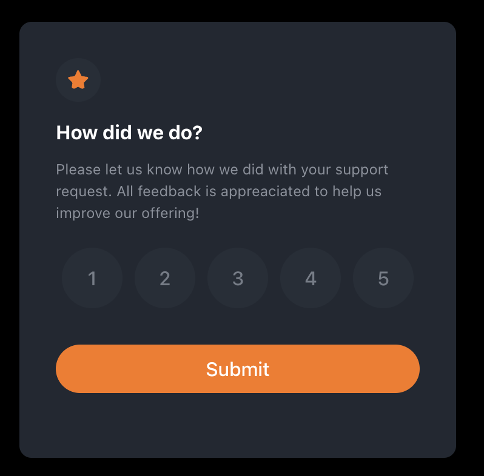

# Frontend Mentor - Interactive rating component solution

This is a solution to the [Interactive rating component challenge on Frontend Mentor](https://www.frontendmentor.io/challenges/interactive-rating-component-koxpeBUmI).

## Table of contents

- [Overview](#overview)
  - [The challenge](#the-challenge)
  - [Screenshot](#screenshot)
  - [Links](#links)
- [My process](#my-process)
  - [Built with](#built-with)
  - [Continued development](#continued-development)
  - [Useful resources](#useful-resources)
- [Author](#author)

## Overview

### The challenge

Users should be able to:

- View the optimal layout for the app depending on their device's screen size
- See hover states for all interactive elements on the page
- Select and submit a number rating
- See the "Thank you" card state after submitting a rating

### Screenshot

- Rating page: 
- Thank you Page:

### Links

- Solution URL: [Add solution URL here](https://github.com/fgrullon/interactive-rating-component)
- Live Site URL: [Add live site URL here](https://interactive-rating-component-942bd2.netlify.app/)

## My process

### Built with

- Semantic HTML5 markup
- CSS custom properties
- Flexbox
- Mobile-first workflow
- [React](https://reactjs.org/) - JS library
- [Vite](https://vitejs.dev/) - React framework
- [Styled Components](https://styled-components.com/) - For styles

### Continued development

One thing i wanna improve is adding a notification when a the form is submitted without selecting a rating.

### Useful resources

- [Vite Getting Started](https://vitejs.dev/guide/) - This helped me for creating the project. I really the simplicity of it.
- [Styled components](https://styled-components.com/docs) - Really like the simplicity of it, planning to use it in the future.

## Author

- Linkeding - [@frank-grullon](https://www.linkedin.com/in/frank-grullon/)
- Twitter - [@fgrullon](https://www.twitter.com/fgrullon)
